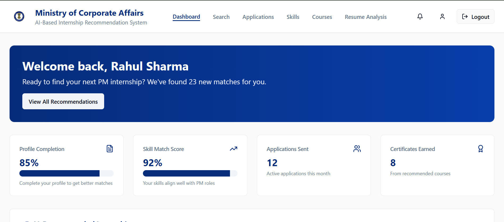
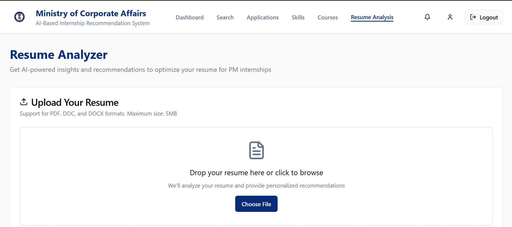
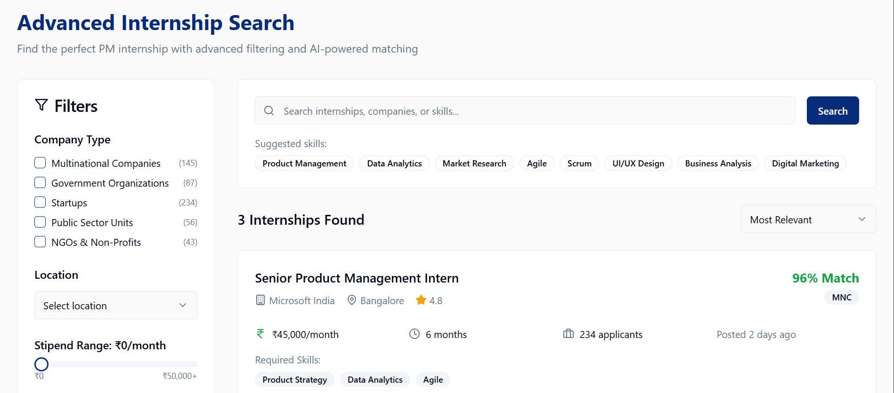
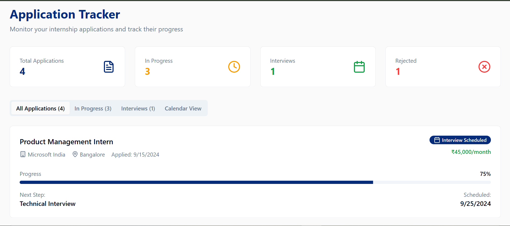
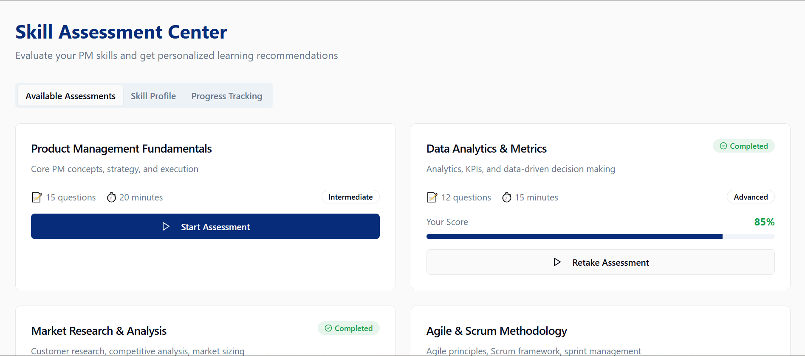
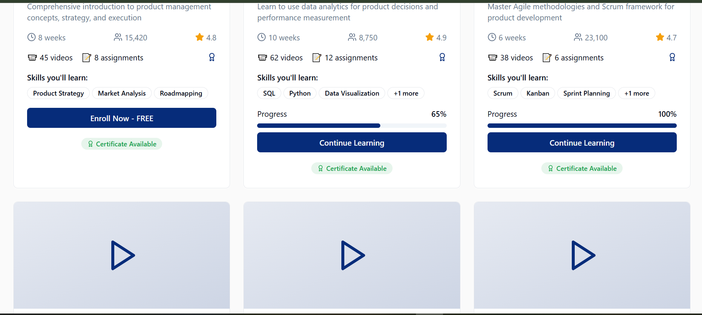

# AI-Based Internship Recommendation System

An AI-powered internship discovery and preparation platform designed to help students find relevant internship opportunities, evaluate their skills, analyze resumes, track applications, and follow personalized learning paths.

## Key Features

- **Personalized Dashboard** – Profile completion, skill-match score, applications, certificates, and recommendations.
- **AI-Powered Internship Search** – Search and filter internships by company type, location, stipend, skills, and relevance.
- **Internship Recommendations** – Matches opportunities with a student's skills and profile.
- **Resume Analyzer** – Resume upload with personalized insights and recommendations.
- **Application Tracker** – Track applications, progress, interviews, schedules, and outcomes.
- **Skill Assessment** – Assess product management, data analytics, market research, and Agile/Scrum skills.
- **Course Recommendations** – Explore learning resources and track progress, assignments, and certificates.
- **Progress Monitoring** – Centralized view of learning, applications, assessments, and skills.

## Technology Stack

- **Frontend:** React, TypeScript
- **Build Tool:** Vite
- **UI:** Tailwind CSS, shadcn/ui
- **Core Concepts:** Internship recommendation, skill matching, resume analysis, data analytics, application tracking

## Application Modules

```text
Dashboard
├── Profile Completion
├── Skill Match Score
├── Internship Recommendations
└── Application & Certificate Summary

Internship Search
├── Keyword Search
├── Company Type Filters
├── Location Filter
├── Stipend Filter
├── Skill Filters
└── Relevance-based Matching

Resume Analyzer
├── Resume Upload
└── Personalized Recommendations

Application Tracker
├── Application Status
├── Interview Tracking
├── Progress Tracking
└── Calendar View

Skill Assessment
├── Product Management
├── Data Analytics & Metrics
├── Market Research
└── Agile & Scrum

Courses
├── Recommended Learning
├── Progress Tracking
├── Assignments
└── Certificates
```

## Screenshots

### Dashboard


### Resume Analyzer


### Internship Search


### Application Tracker


### Skill Assessment Center


### Courses and Learning Progress


## Running the Project Locally

### Prerequisites

- Node.js
- npm

### Installation

```bash
git clone https://github.com/aishwaryakommoju1049-source/ai-internship-recommendation-system.git
cd ai-internship-recommendation-system
npm install
npm run dev
```

Open the local development URL shown in the terminal.

## Project Objective

The project provides a centralized platform for students to discover internships, understand their skill gaps, analyze their resumes, manage applications, and follow relevant learning resources.

## Repository

GitHub: https://github.com/aishwaryakommoju1049-source/ai-internship-recommendation-system
